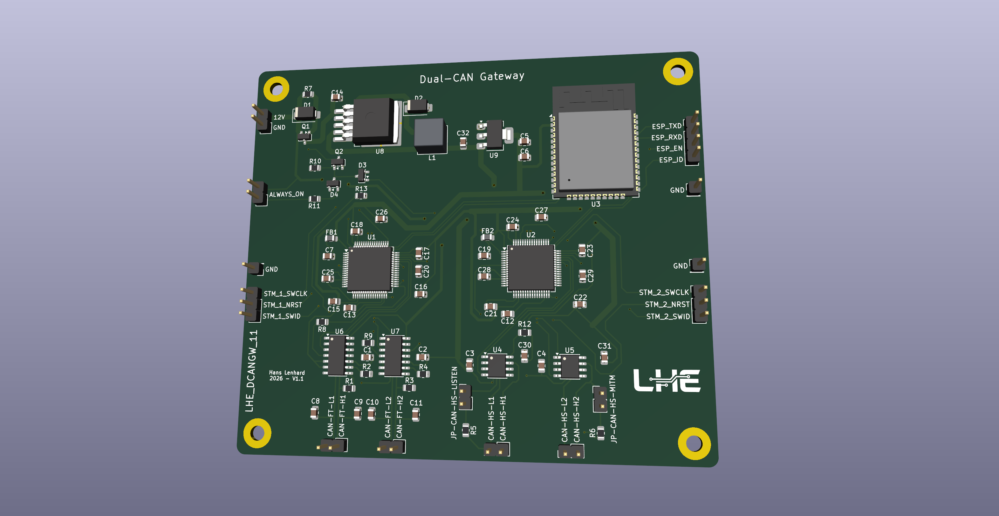

# Automotive Gateway: Multi-Bus ECU Interface, MitM Filter & Telemetry Board

[](https://kicad.org)
[-green.svg)]()
[]()
[]()

An automotive-grade, multi-protocol vehicle network interface, Man-in-the-Middle (MitM) filter, and wireless telemetry gateway. Rather than focusing on CAN alone, this board provides full hardware integration for **all three common automotive ECU communication methods**:
1. **High-Speed CAN (HS-CAN / CAN FD)**
2. **Fault-Tolerant Low-Speed CAN (FT-CAN)**
3. **K-Line / LIN (ISO 9141-2 / ISO 14230 / LIN 2.x)**

All three protocols are driven by two dedicated 32-bit ARM Cortex-M4 microcontrollers and an ESP32 wireless co-processor, featuring dual isolated channels per protocol.



---

## 📑 Table of Contents

- [Overview](#-overview)
- [Operating Modes: Normal vs. MitM](#-operating-modes-normal-vs-mitm)
- [Power Management & Auto-Wake Architecture](#-power-management--auto-wake-architecture)
- [Key Features](#-key-features)
- [System Architecture](#-system-architecture)
- [Hardware & Functional Zones](#-hardware--functional-zones)
- [Pinout & Interface Definitions](#-pinout--interface-definitions)
- [Jumper Configuration Guide](#-jumper-configuration-guide)
- [Bill of Materials (BOM) Summary](#-bill-of-materials-bom-summary)
- [PCB Layout & Physical Specifications](#-pcb-layout--physical-specifications)
- [Getting Started & Flashing Guide](#-getting-started--flashing-guide)
- [Hardware Attribution](#-hardware-attribution)

---

## 🛠 Overview

Modern vehicle architectures rely on three primary communication standards to interconnect Electronic Control Units (ECUs) across various vehicle domains:
- **High-Speed CAN (HS-CAN / CAN FD)**: Up to 1 Mbps (CAN FD capable up to 5 Mbps) for latency-critical powertrain, drivetrain, braking, ABS, and chassis control.
- **Fault-Tolerant Low-Speed CAN (FT-CAN)**: Up to 125 kbps for robust body control, doors, lighting, climate (HVAC), and convenience systems, featuring automatic single-wire fallback upon bus faults.
- **K-Line / LIN (ISO 9141-2 / ISO 14230 / LIN 2.x)**: Bidirectional single-wire 12V automotive bus (up to 20 kbaud) universally used for OBD-II legacy diagnostics, ECU bench reflashing, instrumentation, and LIN sub-busses.

The **Automotive Gateway** provides a unified hardware platform equipped with dedicated transceivers for all three physical layers. It eliminates the need for separate diagnostic interfaces or multiple conversion dongles, serving as a comprehensive tool for active multi-bus communication, real-time message filtering, frame modification, diagnostic proxying, and wireless telemetry streaming via Wi-Fi and Bluetooth BLE.

---

## ⚙️ Operating Modes: Normal vs. MitM

The board features dual physical transceiver channels per communication method (Channel 1 and Channel 2), supporting two primary operating modes:

```
─────────────────────────────────────────────────────────────────────────────────────────────
 Mode 1: Normal Mode (Standalone Additional ECU / Gateway)
 [ Vehicle Network ] ◄──► ( Channel 1 ) ◄──► [ Dual-STM32 + ESP32 ] (Reads & Sends on Busses)

 Mode 2: In-line Man-in-the-Middle Mode (MitM Filter / Message Modification)
 [ Vehicle Network ] ◄──► ( Channel 1 ) ◄──► [ Real-Time Filter ] ◄──► ( Channel 2 ) ◄──► [ Target ECU ]
─────────────────────────────────────────────────────────────────────────────────────────────
```

### 1. Normal Mode (Standalone ECU)
> [!NOTE]
> **There is no listen-only mode.** In Normal Mode, the Automotive Gateway acts as an active, standalone, additional ECU on the vehicle networks.

- **Bi-directional Bus Access**: The gateway actively reads incoming data and transmits outgoing messages on the connected vehicle busses across all three supported physical interfaces (HS-CAN, FT-CAN, and K-Line/LIN).
- **Core Functions**:
  - Functions as an additional standalone ECU node directly participating on the network.
  - Broadcasts custom telemetry, control frames, or simulated sensor messages onto the bus.
  - Sends diagnostic requests (OBD-II, UDS / ISO 14229, KWP2000 / ISO 14230) to other vehicle ECUs and receives responses.
  - Acts as a bi-directional wireless gateway, streaming live multi-bus metrics and receiving remote commands over Wi-Fi (WebSockets, MQTT, REST) or Bluetooth LE.
- **Bus Connectivity**: Connects to the vehicle network via Channel 1 (`CAN-HS1`, `CAN-FT1`, and/or `K-LINE1 Pin 1`). Channel 2 can interface with a second independent vehicle bus, an auxiliary bench network, or remain unpopulated.

### 2. Man-in-the-Middle (MitM) Mode (In-line Filter & Message Modification)
- **Operation**: The gateway is inserted physically in-line between the vehicle wiring harness and a specific target Electronic Control Unit (ECU).
  - **Channel 1 (Network side)**: Connected to the main vehicle bus (`CAN-HS1`, `CAN-FT1`, or `K-LINE1 Pin 1`).
  - **Channel 2 (ECU side)**: Connected directly to the target ECU (`CAN-HS2`, `CAN-FT2`, or `K-LINE1 Pin 2`).
- **Core Functions**:
  - **Message Filtering**: Intercepts bidirectional communications in real time with sub-millisecond determinism to selectively filter out, block, or suppress unwanted messages, diagnostic requests, or forbidden IDs.
  - **Message Modification**: Inspects packets on the fly and modifies payload bytes, alters sensor values (e.g., vehicle speed, odometer, torque parameters), remaps frame IDs, recalculates CRCs/checksums, and retransmits them downstream.
  - **ECU Bench Testing & Security**: Allows fuzzing, spoofing responses, and security validation of a targeted ECU without injecting malformed or test frames into the rest of the vehicle.

---

## ⚡ Power Management & Auto-Wake Architecture

The board features an intelligent automotive power supply designed for both permanent vehicle installation and portable diagnostic use:

```
                        +12V Battery Input (12V1 Pin 1)
                                      │
                         [ D5: SMCJ24CA 24V TVS ]
                                      │
                         [ Q1: AO3401A P-MOSFET ]
                                      │ (12V_Switched)
                                      ▼
                        [ U8: LM2596S-5 Buck Conv ] ──► +5V Rail
                                      │
                        [ U9: AMS1117-3.3 LDO ]    ──► +3.3V Logic Rail
```

### Intelligent Sleep & Auto-Wake Circuit
To prevent 12V battery drain when permanently installed in a vehicle, the module features an ultra-low quiescent sleep circuit:
1. **Sleep State**: The high-side P-channel MOSFET (`Q1`) cuts +12V power to the buck converter (`U8`), completely disabling the 5V and 3.3V rails. The microcontrollers and ESP32 consume **zero current**.
2. **Wake-up Trigger**: The Fault-Tolerant CAN transceiver (`U6`, NXP TJA1055T) remains powered directly from the protected 12V battery rail in ultra-low quiescent standby mode. Upon detecting bus activity on FT-CAN Channel 1, `U6` asserts its `INH` pin HIGH, pulling the gate of N-channel MOSFET `Q2` high via dual Schottky diode `D4`.
3. **Power Latch (Keep-Alive)**: `Q2` activates, pulling `Q1`'s gate low to turn ON the system power rails. Once booted, MCU 1 (`U1`) and MCU 2 (`U2`) assert their respective keep-alive GPIOs (`PC13` via `D3`) to latch power continuously.
4. **Controlled Shutdown**: When vehicle network traffic ceases, the firmware prepares for safe shutdown and de-asserts `PC13`, allowing the board to return to sleep.
5. **Always-On Override (`J3`)**: Installing a jumper on header `J3` (`JP_ALWAYS_ON`) bypasses the auto-wake logic and holds the board permanently powered whenever +12V is present.

---

## ✨ Key Features

- **Dual ARM Cortex-M4 Processing Core**:
  - Two dedicated **STM32F405RGTx** microcontrollers running at **168 MHz** (1 MB Flash, 192 KB SRAM each).
  - **MCU 1 (`U1`)**: Dedicated Low-Speed Fault-Tolerant CAN controller (`CAN1` & `CAN2`).
  - **MCU 2 (`U2`)**: Dedicated High-Speed CAN (`CAN1` & `CAN2`) and Dual K-Line controller (`USART1` & `USART6`).
- **Direct High-Speed Inter-MCU Link**:
  - Dedicated hardware UART bus connecting MCU 1 and MCU 2 (`PC10` / `PC11`) for deterministic cross-bus message passing without co-processor latency.
- **All 3 Common Automotive ECU Physical Layers Supported (Dual Channels Each)**:
  - **High-Speed CAN (HS-CAN / CAN FD)**: 2× NXP `TJA1044GT-3` transceivers (ISO 11898-2:2016, CAN FD ready up to 5 Mbps) with switchable 120 Ω bus termination.
  - **Fault-Tolerant Low-Speed CAN (FT-CAN)**: 2× NXP `TJA1055T/3` transceivers (ISO 11898-3, up to 125 kbps) with single-wire fallback and automatic wake-up signaling.
  - **Dual K-Line / LIN (ISO 9141-2 / ISO 14230 / LIN 2.x)**: 2× NXP `TJA1021xT` transceivers (LIN 2.2A / SAE J2602) supporting OBD-II and KWP2000 diagnostic lines up to 20 kbaud.
- **Wireless Telemetry Co-Processor**:
  - **ESP32-WROOM-32UE** module with 2.4 GHz Wi-Fi (802.11 b/g/n) and Bluetooth v4.2 BR/EDR & BLE.
  - Integrated U.FL external antenna connector for high-gain antenna placement inside vehicle dashboards or engine bays.
  - Dual independent high-speed UART links connecting to MCU 1 and MCU 2.
- **User Interface & Diagnostic Feedback**:
  - Onboard RGB Status LED (`D6`, SMD 1210) driven by ESP32 GPIOs for mode, packet activity, and error signaling.
  - Tactile push buttons for ESP32 hardware `RESET` and `BOOT` (GPIO0).
- **Automotive Protection & Regulation**:
  - Automotive transient voltage suppressor (`D5`, SMCJ24CA bidirectional TVS).
  - P-channel MOSFET (`Q1`, AO3401A) reverse polarity and high-side power switching.
  - 12V Zener (`D1`, MMSZ12T1G) Vgs gate overvoltage clamp.
  - High-efficiency switching buck regulator (`U8`, LM2596S-5, 3A capacity).
  - Low-dropout linear regulator (`U9`, AMS1117-3.3, 1A capacity).
  - Ferrite bead filtering (`FB1`, `FB2`) on analog power supplies (`VDDA`).

---

## 📐 System Architecture

```
                                  +12V AUTOMOTIVE BATTERY (12V1)
                                                │
                          ┌─────────────────────┴─────────────────────┐
                          ▼                                           ▼
             [ SMCJ24CA 24V TVS Clamp ]                  [ AO3401A P-MOSFET Switch ]
                          │                                           │ (12V_Switched)
                          │                                           ▼
                          │                              [ LM2596S-5 Buck Regulator ] ──► +5V Rail
                          │                                           │
                          │                              [ AMS1117-3.3 LDO Regulator] ──► +3.3V Rail
                          │                                           │
         ┌────────────────┴───────────────────────────────────────────┴────────────────────────┐
         │                                                            │                        │
         ▼                                                            ▼                        ▼
┌───────────────────────────────┐               ┌───────────────────────────────┐   ┌──────────────────────┐
│      STM32F405 #1 (MCU 1)     │               │      STM32F405 #2 (MCU 2)     │   │   ESP32-WROOM-32UE   │
│   Low-Speed Fault-Tolerant    │◄─────────────►│     High-Speed CAN & K-Line   │   │   Wireless Gateway   │
│   CAN Controller (168 MHz)    │  Direct UART  │     Controller (168 MHz)      │   │   (Wi-Fi / BT / BLE) │
└──────┬─────────────────┬──────┘   (PC10/PC11) └──────┬─────────────────┬──────┘   └───────┬──────┬───────┘
       │ (CAN1)          │ (CAN2)                      │ (CAN1)          │ (CAN2)           │      │
       ▼                 ▼                             ▼                 ▼                  │      │
 ┌───────────┐     ┌───────────┐                 ┌───────────┐     ┌───────────┐            │      │
 │  TJA1055T │     │  TJA1055T │                 │ TJA1044GT │     │ TJA1044GT │      UART1 │      │ UART2
 │ (FT-CAN1) │     │ (FT-CAN2) │                 │ (HS-CAN1) │     │ (HS-CAN2) │   (PA2/PA3)│      │(PA2/PA3)
 └─────┬─────┘     └─────┬─────┘                 └─────┬─────┘     └─────┬─────┘            │      │
       │                 │                             │                 │                  │      │
       ▼                 ▼                             ▼                 ▼                  │      │
 [  CAN-FT1  ]     [  CAN-FT2  ]                 [  CAN-HS1  ]     [  CAN-HS2  ]            ▼      ▼
 (Channel 1)       (Channel 2)                   (Channel 1)       (Channel 2)          [ Independent ]
  Normal / MitM     Normal / MitM                 Normal / MitM     Normal / MitM       [ UART Links  ]
                                                       │                 │                     │
                                                 ┌─────┴─────┐     ┌─────┴─────┐               ▼
                                                 │JP-CAN-HS1 │     │JP-CAN-HS2 │        [ RGB LED (D6) ]
                                                 │(120Ω Term)│     │(120Ω Term)│        [ GPIO25/26/27 ]
                                                 └───────────┘     └───────────┘
                                                
                                                [ MCU 2 UARTs (USART6 / USART1) ]
                                                               │
                                                   ┌───────────┴───────────┐
                                                   ▼                       ▼
                                             ┌───────────┐           ┌───────────┐
                                             │ TJA1021xT │           │ TJA1021xT │
                                             │ (K-Line 1)│           │ (K-Line 2)│
                                             └─────┬─────┘           └─────┬─────┘
                                                   │                       │
                                                   ▼                       ▼
                                             [        K-LINE1 Header       ]
                                             [  Pin 1: Ch 1  |  Pin 2: Ch 2]
                                             [         Normal / MitM       ]
```

---

## 🔍 Hardware & Functional Zones

### Zone 1: Power Regulation, Switching & Protection
- **Power Input**: Connector `12V1` (Pin 1: `+12V_Protected`, Pin 2: `GND`).
- **Protection**:
  - `D5` (`SMCJ24CA`): Bidirectional TVS diode clamps automotive load-dump surges.
  - `Q1` (`AO3401A`): P-channel MOSFET provides high-side switching and reverse-polarity protection.
  - `D1` (`MMSZ12T1G`): 12V Zener clamps gate-source voltage ($V_{GS}$) of `Q1`.
  - `D2` (`SS34`): 3A 40V Schottky barrier rectifier for the buck switching regulator.
- **Power Switching Logic**:
  - `Q2` (`2N7002`): N-channel MOSFET drives `Q1`'s gate low to enable system power.
  - `D4` (`BAT54C`): Dual diode ORs the auto-wake signal from `U6` (`INH`) and `J3` (`ALWAYS_ON`).
  - `D3` (`BAT54C`): Dual diode ORs keep-alive latch signals from MCU 1 (`U1 PC13`) and MCU 2 (`U2 PC13`).
- **Regulators**:
  - `U8` (`LM2596S-5`): High-efficiency 5V 3A step-down switching regulator.
  - `U9` (`AMS1117-3.3`): 3.3V 1A linear LDO regulator for logic and radio power.

### Zone 2: MCU #1 – Low-Speed Fault-Tolerant CAN Core
- **Microcontroller**: `U1` (`STM32F405RGTx` LQFP-64, ARM Cortex-M4 @ 168 MHz).
- **Transceivers**: `U6` & `U7` (`NXP TJA1055T/3` SOIC-14).
- **Pin Mapping**:
  - `FT-CAN 1` (Channel 1): RX = `PA11`, TX = `PA12`, Wake Inhibit = `U6 INH`, Error = `U6 ~ERR` (`PB11` via `R8`), Standby = `PC7`, Enable = `PC8`.
  - `FT-CAN 2` (Channel 2): RX = `PB5`, TX = `PB6`, Error = `U7 ~ERR` (`PB12` via `R9`), Standby/Enable = Tied to 3.3V.
  - Power Keep-Alive: `PC13` (controls `Q2` gate via `D3`).
  - Inter-MCU Link: TX = `PC10`, RX = `PC11` (connects directly to MCU 2).
  - ESP32 Link: TX = `PA2`, RX = `PA3` (connects to ESP32 `IO19` / `IO18`).
  - SWD Debug: SWCLK = `PA14`, SWDIO = `PA13`, NRST = `Pin 7`.

### Zone 3: MCU #2 – High-Speed CAN & Dual K-Line Core
- **Microcontroller**: `U2` (`STM32F405RGTx` LQFP-64, ARM Cortex-M4 @ 168 MHz).
- **High-Speed Transceivers**: `U4` & `U5` (`NXP TJA1044GT-3` SOIC-8).
- **K-Line Transceivers**: `U10` & `U11` (`NXP TJA1021xT` SOIC-8).
- **Pin Mapping**:
  - `HS-CAN 1` (Channel 1): RX = `PA11`, TX = `PA12`.
  - `HS-CAN 2` (Channel 2): RX = `PB5`, TX = `PB6`.
  - `K-Line 1` (Channel 1, `U10`): TX = `PC6` (`USART6_TX`), RX = `PC7` (`USART6_RX`).
  - `K-Line 2` (Channel 2, `U11`): TX = `PA9` (`USART1_TX`), RX = `PA10` (`USART1_RX`).
  - Power Keep-Alive: `PC13` (controls `Q2` gate via `D3`).
  - Inter-MCU Link: TX = `PC10`, RX = `PC11` (connects directly to MCU 1).
  - ESP32 Link: TX = `PA2`, RX = `PA3` (connects to ESP32 `IO17` / `IO16`).
  - SWD Debug: SWCLK = `PA14`, SWDIO = `PA13`, NRST = `Pin 7`.

### Zone 4: ESP32 Wireless Telemetry Co-Processor
- **Module**: `U3` (`ESP32-WROOM-32UE` with external U.FL antenna jack).
- **Pin Mapping**:
  - Link to MCU 1: RX = `IO19`, TX = `IO18`.
  - Link to MCU 2: RX = `IO16`, TX = `IO17`.
  - Programming Port: `TXD0` (`Pin 35`), `RXD0` (`Pin 34`), `EN` (`Pin 3`), `IO0` (`Pin 25`).
  - RGB Status LED (`D6`): Red = `IO25`, Green = `IO26`, Blue = `IO27`.
  - Hardware Buttons: `RESET` (pulls `EN` low), `BOOT` (pulls `IO0` low).

---

## 🔌 Pinout & Interface Definitions

All external signals, power, bus lines, and programming ports are brought out to standardized 2.54 mm pin headers:

### 1. Automotive Power Header (`12V1`)
| Pin | Silkscreen | Net Name | Voltage Range | Description |
| :---: | :--- | :--- | :--- | :--- |
| **1** | *(Square pad)* | `/12V_Protected` | +7.0V to +18.0V DC | Primary Automotive Battery/Ignition Supply |
| **2** | `GND` | `/GND` | 0V | Common Chassis / System Ground |

### 2. High-Speed CAN Connectors
| Connector | Pin | Silkscreen | Signal | Transceiver Pin | Function / Topology |
| :--- | :---: | :--- | :--- | :--- | :--- |
| **`CAN-HS1`** | 1 | `CAN-HS-L1` | `CAN_L` | `U4` Pin 6 | **Channel 1**: Normal Mode (Vehicle Bus) / MitM Input |
| | 2 | `CAN-HS-H1` | `CAN_H` | `U4` Pin 7 | **Channel 1**: Normal Mode (Vehicle Bus) / MitM Input |
| **`CAN-HS2`** | 1 | `CAN-HS-L2` | `CAN_L` | `U5` Pin 6 | **Channel 2**: MitM Output (Target ECU) / Secondary Bus |
| | 2 | `CAN-HS-H2` | `CAN_H` | `U5` Pin 7 | **Channel 2**: MitM Output (Target ECU) / Secondary Bus |

### 3. Fault-Tolerant Low-Speed CAN Connectors
| Connector | Pin | Silkscreen | Signal | Transceiver Pin | Function / Topology |
| :--- | :---: | :--- | :--- | :--- | :--- |
| **`CAN-FT1`** | 1 | `CAN-FT-L1` | `CAN_L` | `U6` Pin 12 | **Channel 1**: Normal Mode (Vehicle Bus) / MitM Input / Auto-Wake |
| | 2 | `CAN-FT-H1` | `CAN_H` | `U6` Pin 11 | **Channel 1**: Normal Mode (Vehicle Bus) / MitM Input / Auto-Wake |
| **`CAN-FT2`** | 1 | `CAN-FT-L2` | `CAN_L` | `U7` Pin 12 | **Channel 2**: MitM Output (Target ECU) / Secondary Bus |
| | 2 | `CAN-FT-H2` | `CAN_H` | `U7` Pin 11 | **Channel 2**: MitM Output (Target ECU) / Secondary Bus |

### 4. Dual K-Line / LIN Connector (`K-LINE1`)
| Pin | Silkscreen | Connected Transceiver | MCU Peripheral | Operating Voltage | Function / Topology |
| :---: | :--- | :--- | :--- | :---: | :--- |
| **1** | *(Pin 1)* | `U10` (TJA1021xT Pin 6) | MCU 2 `USART6` (`PC6`/`PC7`) | 12V Automotive | **Channel 1**: Normal Mode (OBD-II / Harness) / MitM Input |
| **2** | `K-LINE2` | `U11` (TJA1021xT Pin 6) | MCU 2 `USART1` (`PA9`/`PA10`)| 12V Automotive | **Channel 2**: MitM Output (Target ECU) / Secondary K-Line |

### 5. Programming & SWD Debug Headers
| Header | Pin 1 | Pin 2 | Pin 3 | Pin 4 | Pin 5 | Target IC |
| :--- | :---: | :---: | :---: | :---: | :---: | :--- |
| **`STM_FLASH1`** | `+3.3V` | `GND` | `SWDIO` (`PA13`) | `NRST` | `SWCLK` (`PA14`) | MCU 1 (STM32F405 FT-CAN Core) |
| **`STM_FLASH2`** | `+3.3V` | `GND` | `SWDIO` (`PA13`) | `NRST` | `SWCLK` (`PA14`) | MCU 2 (STM32F405 HS-CAN & K-Line Core) |
| **`ESP_FLASH1`** | `TXD0` | `RXD0` | `ESP_EN` | `GPIO0 (BOOT)` | `GND` | ESP32-WROOM-32UE Wireless Co-Processor |

---

## 🎛 Jumper Configuration Guide

| Jumper Header | Silkscreen | Function | Jumper Installed (Closed) | Jumper Removed (Open) | Default |
| :--- | :--- | :--- | :--- | :--- | :---: |
| **`J3`** | `ALWAYS_ON` | Power Control Mode | **Always-On**: Board powered whenever 12V is connected. | **Auto-Sleep / Wake**: Board sleeps; wakes on FT-CAN activity. | *Open* |
| **`JP-CAN-HS1`** | *(Near CAN-HS1)* | HS-CAN 1 Bus Termination | **120 Ω Enabled** (`R5` connected across H and L). | **Unterminated** (For active vehicle bus connection). | *Open* |
| **`JP-CAN-HS2`** | *(Near CAN-HS2)* | HS-CAN 2 Bus Termination | **120 Ω Enabled** (`R6` connected across H and L). | **Unterminated** (For active vehicle bus connection). | *Open* |

> [!TIP]
> - In **Normal Mode** connected to an active vehicle network, keep `JP-CAN-HS1` and `JP-CAN-HS2` **OPEN** because the vehicle network already provides the required split 60 Ω termination.
> - In **MitM Mode** or bench-testing an isolated ECU, install the jumper on the isolated segment (`JP-CAN-HS2`) to provide the required 120 Ω termination for CAN transceivers.

---

## 📦 Bill of Materials (BOM) Summary

| Reference Designator | Component Value | Package / Footprint | Qty | Description |
| :--- | :--- | :--- | :---: | :--- |
| **`U1`, `U2`** | `STM32F405RGTx` | LQFP-64 (10×10 mm, 0.5 mm pitch) | 2 | 32-bit ARM Cortex-M4 MCU (168 MHz, 1MB Flash, 192KB RAM) |
| **`U3`** | `ESP32-WROOM-32UE` | RF Module (18×25.5 mm) | 1 | Dual-Core Wi-Fi & BLE Co-Processor (U.FL antenna) |
| **`U4`, `U5`** | `TJA1044GT-3` | SOIC-8 (3.9×4.9 mm, 1.27 mm pitch) | 2 | High-Speed CAN Transceiver (CAN FD capable, 5 Mbps) |
| **`U6`, `U7`** | `TJA1055T/3` | SOIC-14 (3.9×8.7 mm, 1.27 mm pitch) | 2 | Fault-Tolerant Low-Speed CAN Transceiver (125 kbps) |
| **`U10`, `U11`** | `TJA1021xT` | SOIC-8 (3.9×4.9 mm, 1.27 mm pitch) | 2 | LIN 2.2A / K-Line Physical Transceiver (ISO 9141-2) |
| **`U8`** | `LM2596S-5` | TO-263-5 (D2PAK) | 1 | 5V 3A Step-Down Switching Buck Regulator |
| **`U9`** | `AMS1117-3.3` | SOT-223-3 | 1 | 3.3V 1A Low-Dropout Linear Regulator |
| **`Q1`** | `AO3401A` | SOT-23 | 1 | P-Channel MOSFET (-30V, -4.2A, Power Switch / Rev. Pol.) |
| **`Q2`** | `2N7002` | SOT-23 | 1 | N-Channel Signal MOSFET (60V, 115mA, Gate Driver) |
| **`D1`** | `MMSZ12T1G` | SOD-123 / SMA | 1 | 12V 500mW Zener Diode (MOSFET Vgs Clamp) |
| **`D2`** | `SS34` | DO-214AC (SMA) | 1 | 3A 40V Schottky Barrier Rectifier Diode |
| **`D3`, `D4`** | `BAT54C` | SOT-23 | 2 | Dual Common-Cathode 30V Schottky Diodes |
| **`D5`** | `SMCJ24CA` | DO-214AB (SMC) | 1 | 24V 1500W Bidirectional TVS Surge Clamping Diode |
| **`D6`** | `LED_RGBA` | SMD 1210 (Common Anode) | 1 | RGB Status & Diagnostic Indicator LED |
| **`L1`** | `33-68 µH` | Bourns SRP6060FA (SMD Inductor) | 1 | Power Inductor for LM2596 Buck Converter |
| **`FB1`, `FB2`** | `Ferrite Bead` | SMD 0805 | 2 | High-Frequency Analog Noise Filtering Beads (`VDDA`) |
| **`RESET`, `BOOT`** | `PTS636Sx25` | Tactile Switch SMD | 2 | Push buttons for ESP32 Hardware Reset & Boot Mode |
| **`R5`, `R6`** | `120 Ω` | SMD 0805 (1%) | 2 | High-Speed CAN Bus Termination Resistors |
| **`R1` - `R4`** | `560 Ω` | SMD 0805 (1%) | 4 | Fault-Tolerant CAN Bias/Termination Resistors |
| **`R20` - `R22`** | `1 kΩ` | SMD 0805 | 3 | RGB LED Current Limiting Resistors |
| **`R7`, `R13`** | `100 kΩ` | SMD 0805 | 2 | Gate & Inhibit Pull-Down Resistors |
| **`R8` - `R12`, `R14` - `R19`** | `10 kΩ` | SMD 0805 | 11 | Pull-Up / Pull-Down / Logic Bias Resistors |
| **`C14`** | `100 µF` | SMD Aluminum Electrolytic (6.3×7.7 mm)| 1 | 12V Switched Input Decoupling |
| **`C5`, `C32`** | `220 µF` | EIA-6032-28 (Kemet C Tantalum) | 2 | 5V and 3.3V Output Smoothing Capacitors |
| **`C8` - `C11`** | `5.6 nF` | SMD 0805 | 4 | FT-CAN Bus Filter Capacitors |
| **`C12`, `C13`, `C20`, `C29`** | `2.2 µF` | SMD 0805 | 4 | MCU VCAP Core Decoupling Capacitors |
| **`C26`, `C27`** | `4.7 µF` | SMD 0805 | 2 | Power Rail Filtering Capacitors |
| **`C25`, `C28`, `C34`** | `1 µF` | SMD 0805 | 3 | Logic Decoupling Capacitors |
| **`C1` - `C4`, `C6`, `C7`, `C15` - `C19`, `C21` - `C24`, `C30`, `C31`, `C33`, `C35` - `C39` | `100 nF` | SMD 0805 | 22 | Local IC Decoupling Ceramic Capacitors |
| **`12V1`, `J3`, `CAN-HS1/2`, `CAN-FT1/2`, `JP-CAN-HS1/2`, `K-LINE1`** | `Conn_01x02_Pin` | 2.54 mm Pin Header (1×02) | 8 | External Power, Bus & Termination Headers |
| **`STM_FLASH1`, `STM_FLASH2`, `ESP_FLASH1`** | `Conn_01x05_Pin` | 2.54 mm Pin Header (1×05) | 3 | Programming and SWD Debug Headers |
| **`H1` - `H4`** | `MountingHole_Pad` | 3.2 mm Diameter (M3 Pad) | 4 | Grounded Chassis M3 Mounting Holes |

---

## 📏 PCB Layout & Physical Specifications

- **Dimensions**: **101.60 mm × 88.90 mm** (4.00" × 3.50")
- **Corner Fillet**: 2.0 mm corner radius
- **Layer Count**: **2 Copper Layers** (`F.Cu` Top Layer, `B.Cu` Bottom Layer)
- **Board Thickness**: Standard 1.6 mm FR4
- **Copper Thickness**: 1 oz (35 µm)
- **Ground Planes**: Continuous, low-impedance ground fill on the bottom layer with stitched return paths for high-frequency CAN differential lines.
- **Mounting**: 4× grounded M3 mounting holes located at the corners.
- **Footprint Pitch**: Standard 0805 (2012 metric) passive SMD footprints for reliable hand-soldering and prototype assembly.
- **Total Footprint Count**: 103 placed board footprints.

---

## 🚀 Getting Started & Flashing Guide

### 1. Opening the KiCad Project
1. Install **KiCad 8.0** or newer.
2. Clone the repository:
   ```bash
   git clone https://github.com/dexus1337/automotive-gateway.git
   ```
3. Open `automotive-gateway.kicad_pro` to inspect or modify schematics and PCB layout.

### 2. Flashing STM32 Microcontrollers (MCU 1 & MCU 2)
The board features independent 5-pin SWD headers for each STM32F405 MCU:
- **MCU 1 (Low-Speed FT-CAN Core)**: Connect an ST-LINK V2/V3 to `STM_FLASH1` (`3.3V`, `GND`, `SWDIO`, `NRST`, `SWCLK`).
- **MCU 2 (High-Speed CAN & K-Line Core)**: Connect an ST-LINK to `STM_FLASH2` (`3.3V`, `GND`, `SWDIO`, `NRST`, `SWCLK`).
- Compatible toolchains: **STM32CubeIDE**, **PlatformIO** (`ststm32`), or **Keil MDK**.

### 3. Flashing the ESP32 Wireless Co-Processor
1. Connect a 3.3V USB-to-UART adapter to `ESP_FLASH1`:
   - Adapter TX ──► `ESP_RXD` (Pin 2)
   - Adapter RX ──► `ESP_TXD` (Pin 1)
   - Adapter GND ──► `ESP_GND` (Pin 5)
2. Enter Bootloader Mode:
   - Hold down the **`BOOT`** button.
   - Press and release the **`RESET`** button.
   - Release the **`BOOT`** button.
3. Flash using **ESP-IDF**, **esptool.py**, or **PlatformIO** (`espressif32`).

---

## 👤 Hardware Attribution

- **Hardware Design & Engineering**: Hans Lenhard
- **Hardware Revision**: V1.1 (2026)
- **Silkscreen Identification**: `LHE_DCANGW_11`
